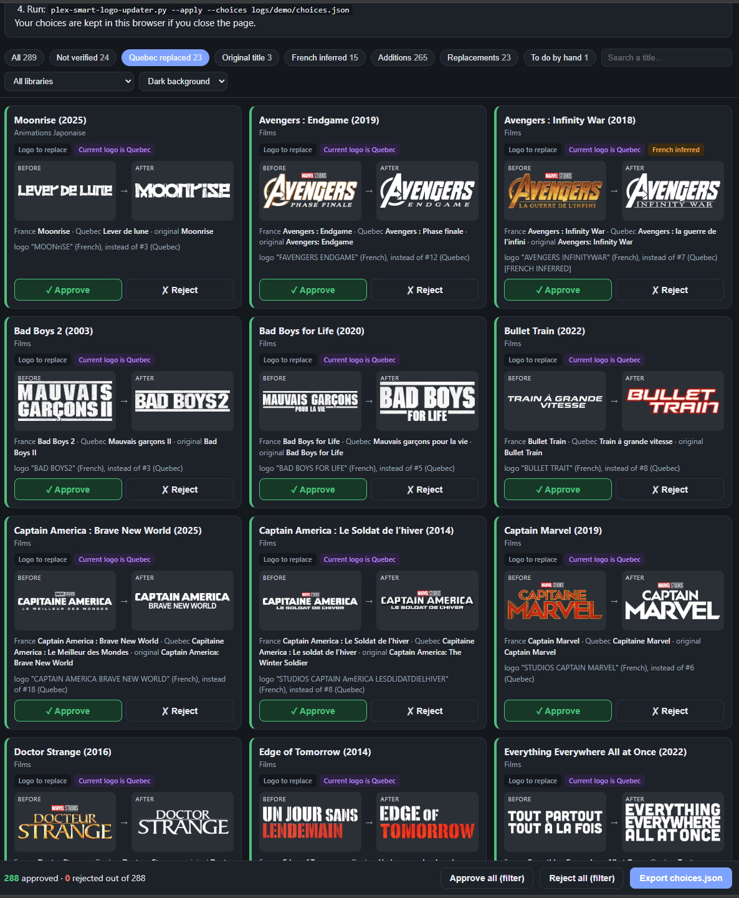
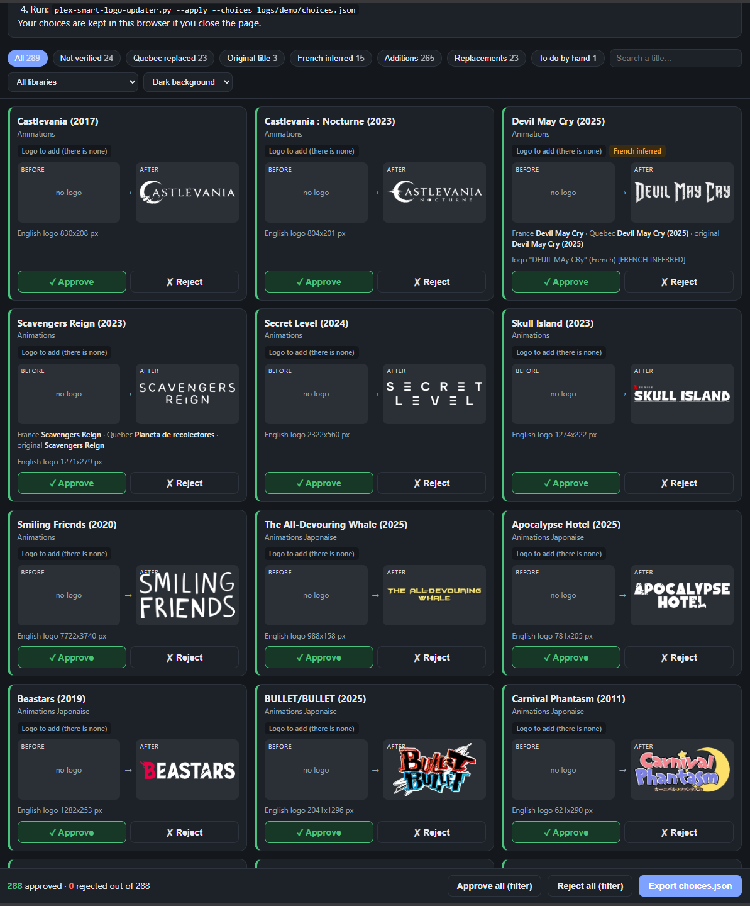

# plex smart logo updater

[](https://github.com/sSlydee/plex-smart-logo-updater/actions/workflows/tests.yml) [](https://github.com/sSlydee/plex-smart-logo-updater/releases) [](LICENSE)

**Smarter Plex logos (ClearLogo): the right logo in each library's language, with an English fallback, and no French-Canadian logos in French libraries.**

🇫🇷 [Version française](README.fr.md)

A Python script that gives your Plex movies and shows a **good-quality logo in the language of their library**, including the many titles Plex leaves without one. For French libraries, it also detects and replaces the **French-Canadian (Quebec) logos** that Plex sometimes picks by mistake.

Every change is previewed first: a dry run, a review page to approve or reject each logo, and an undo journal.

Based on [relkai/plex-bulk-logo-updater](https://github.com/relkai/plex-bulk-logo-updater) (MIT license).



## The problem

Plex only sets a logo automatically **when one exists in the library language**. In a French, German or Spanish library, a title without a logo in that language therefore stays without a logo, even when a good English one exists. This is very common for anime and foreign films.

French libraries have a second trap: **Plex does not tell French (France) from French (Quebec) apart.** It may set a Quebec logo in a French library. The title then reads "The Banker" while the logo says "Le financier"; likewise, "Edge of Tomorrow" may show up with the logo "Un jour sans lendemain".

The original script simply picked the first logo in the list, which may be in the wrong language or of poor quality.

By default each library uses **its own language** (as set in Plex), then English: a French library gets French logos, a German one German logos, an English one English logos.

## What `plex-smart-logo-updater.py` does

For every title in the selected libraries:

1. **It never touches a hand-picked (locked) logo**, except with `--fix-locked-quebec` when it is a Quebec logo. A locked field *without* a logo gets a proposal like any title without a logo: reject it in the review page to keep the title as it is (it then goes to the [ignore list](#ignore-list)). It does not touch logos set by Plex either, **unless they are Quebec logos**.
2. **For titles without a logo, it asks Plex for the logo it recommends**, in the library's language first, then in English if there is none. This is exactly the logo Plex would have picked itself. The script queries Plex's metadata service (`metadata.provider.plex.tv`) with your Plex token; no TMDB key is needed.
3. **It finds that logo among the ones your server offers** (same URL, or pixel-identical image) and selects it. It only uploads it from the Internet when it cannot find it.

By default the script does a **dry run**: it shows what it would do without changing anything.

### Quebec logo detection

For each title, the script compares the French (fr-FR) and Quebec (fr-CA) titles provided by Plex. When they differ, it **reads the logo text** with OCR (`quebec.py`) and compares it with the French, Quebec and original titles:

- **A Quebec logo set by Plex is replaced** with the best non-Quebec logo: the one whose text is closest to the **full French title**, otherwise to the original title. At equal similarity, the script prefers, in this order:
  1. a logo **without extra text** (actor names, taglines; "Marvel Studios", "Disney"… are tolerated);
  2. a logo in the **same style** as the one being replaced (colored or white);
  3. the one Plex recommends;
  4. the largest one.
- When the French title differs from the original title and the logo recommended by Plex is not clearly French (English, unreadable…), the script looks for a logo showing the French title among the others (e.g. "HAPPY BIRTHDEAD" rather than "HAPPY DEATH DAY"). When France keeps the original title, Plex's pick is kept.
- **A Quebec logo is never added.** If Plex recommends a Quebec logo, the script looks for another one.
- If **only** Quebec logos exist, the title is tagged `[CHECK]`: do it by hand.
- A **locked** logo that looks like a Quebec one is reported in the logs. It is only replaced with `--fix-locked-quebec`.
- When Quebec keeps the original title ("Black Box Diaries"), a logo showing that title is **not** considered a Quebec logo.

Detection is deliberately cautious: an existing logo is only replaced when it is clearly read as a Quebec logo.

Three **special mentions** flag logos set with less certainty:

| Mention | Meaning |
|---|---|
| `[FRENCH INFERRED]` | The French title is read on the logo and the words specific to the Quebec title are missing (e.g. "PUSH" while Quebec says "Push : La division"). Very likely correct. |
| `[ORIGINAL TITLE]` | The logo shows the original title, neither French nor Quebec (e.g. "HAPPY DEATH DAY" for *Happy Birthdead*). |
| `[NOT VERIFIED]` | The OCR could not read the logo (very stylized font, spaced letters…). The logo is set anyway, as Plex would have done: **check it**. |

OCR results are cached (`.cache-ocr.json`): a new run only reads new logos.

## Installation

New to GitHub or to the command line? This step-by-step guide takes you from zero to your first dry run. It takes about 10 minutes, most of it waiting for downloads.

### What you need

- **A Linux machine that can reach your Plex server**: the Plex server itself, a seedbox, a NAS, a VPS… It was tested on Linux; macOS should work; on Windows, use [WSL](https://learn.microsoft.com/windows/wsl/install).
- **Python 3.8 or later** and **git**.
- **Your Plex token** ([how to find it](https://support.plex.tv/articles/204059436-finding-an-authentication-token-x-plex-token/)).
- About **500 MB of free disk space** for the Python environment (the OCR engine is the largest part).

### Step 1 — Open a terminal on the machine

If the machine is remote (seedbox, NAS, VPS), connect with SSH from your computer: open a terminal (PowerShell on Windows, Terminal on macOS/Linux) and type:

```bash
ssh your_user@your_server_address
```

Then check that Python and git are installed:

```bash
python3 --version
git --version
```

Each command should print a version number (Python must be 3.8 or later). If one is missing, install it with your system's package manager (e.g. `sudo apt install python3 python3-venv git` on Debian/Ubuntu) or ask your provider.

### Step 2 — Download the project ("clone" the repository)

Go to the folder where you want to install it (your home folder is fine), then clone the repository. Cloning downloads the project and keeps the link to GitHub, so you can update it later with a single command.

```bash
cd ~
git clone https://github.com/sSlydee/plex-smart-logo-updater.git
cd plex-smart-logo-updater
```

You now have a `plex-smart-logo-updater` folder containing the scripts.

### Step 3 — Install

```bash
./install.sh
```

The installer creates a dedicated Python environment in the `.venv` folder (nothing is installed system-wide), downloads the dependencies (a few minutes), then starts the **setup wizard**.

The installer replaces OpenCV 5, pulled in by the OCR library, with an older build: on some machines OpenCV 5 crashes on import.

### Step 4 — Answer the setup wizard

The wizard asks five questions; press Enter to accept the value shown in `[brackets]`.

1. **Plex server address**: the server's **local** address, with its port.
   - The script runs on the Plex server itself: `http://127.0.0.1:32400`.
   - Plex runs in Docker on the same machine: often `http://172.17.0.1:32400`.
   - Another machine on your network: `http://192.168.x.x:32400`.

   Avoid a public domain name behind a reverse proxy: the number of requests could get you blocked by Fail2Ban or CrowdSec.
2. **Plex token**: paste it (nothing is displayed while you paste, that is normal). The wizard tests the connection right away.
3. **Libraries**: type the numbers of the libraries to process, separated by commas (e.g. `1,3,4`), or `all`.
4. **Logo language**: keep `auto` (each library's own language, then English) unless you have a reason to force one.
5. **Notifications** and **automatic run**: optional, you can answer `n` / `never` now and come back later (see [Configuration](#configuration)).

Your answers are saved in `config.env`, readable by you only.

### Step 5 — First dry run

```bash
.venv/bin/python plex-smart-logo-updater.py --html
```

Nothing is changed in Plex. The first run takes longer (about 7 minutes for 300 movies) because it reads the logos; later runs use a cache. At the end, the summary shows what would change and where the review page (`review.html`) is.

Then follow the [recommended workflow](#recommended-workflow-dry-run-review-apply) to review and apply the changes.

> Always run the script with `.venv/bin/python`, not `python3`: the dependencies are installed in `.venv` only.

### Downloading files from a remote machine

To open `review.html` on your computer and send `choices.json` back, use an SFTP client with the same address and login as SSH:

- **Windows**: [WinSCP](https://winscp.net/) or [FileZilla](https://filezilla-project.org/)
- **macOS**: [Cyberduck](https://cyberduck.io/) or FileZilla
- **Linux**: your file manager (`sftp://your_user@your_server_address`) or FileZilla

Or from a terminal on your computer:

```bash
scp your_user@your_server_address:plex-smart-logo-updater/logs/<folder>/review.html .
scp choices.json your_user@your_server_address:plex-smart-logo-updater/logs/<folder>/
```

### Updating

```bash
cd ~/plex-smart-logo-updater
git pull
./install.sh --no-config
```

`git pull` downloads the new version from GitHub; `./install.sh --no-config` updates the dependencies without asking the setup questions again. Your `config.env`, logs and cache are kept. See [CHANGELOG.md](CHANGELOG.md) for what changed.

### Uninstalling

```bash
cd ~/plex-smart-logo-updater
.venv/bin/python configure.py --cron     # choose "never" to remove the automatic run
cd ~
rm -rf plex-smart-logo-updater
```

Logos already set in Plex stay in place. To restore the previous logos first, use [`--undo`](#undoing-an-application) on your application folders.

### Troubleshooting

| Problem | Solution |
|---|---|
| `Permission denied` when running `./install.sh` | Run `bash install.sh` instead. |
| `Python 3.8 or later is required` | Install a newer Python, or run `PYTHON=python3.11 ./install.sh` if several versions are installed. |
| `No module named ...` | Run the script with `.venv/bin/python`, not `python3`. |
| `Plex token rejected` | Your token changed: `.venv/bin/python configure.py --token`. |
| `Cannot connect to the Plex server` | Check the address and port; from the machine, `curl http://address:32400/identity` should answer. |
| `Libraries not found` | The names in `PLEX_LIBRARIES` must match Plex exactly: `.venv/bin/python configure.py --libraries`. |
| The installer stops with `The dependencies do not load correctly` | Delete the `.venv` folder and run `./install.sh` again; if it persists, open an issue with the full output. |

## Configuration

The setup wizard (step 4 above) writes `config.env` next to the script. It covers:

1. the Plex server address and your token, with a **connection test**;
2. the libraries to process, picked from **your server's list**;
3. the logo language (by default, each library's own language, then English);
4. notifications (Discord, Bark, generic webhook), with **a test message**;
5. the **automatic run** in cron: daily, weekly or never.

To change the configuration later, run the wizard again. Current values are offered as defaults: press Enter to keep them.

```bash
.venv/bin/python configure.py
```

To redo a single step:

| Command | Effect |
|---|---|
| `configure.py --token` | Changes **only the token**: it is prompted for, tested, then saved |
| `configure.py --token <new token>` | Same without prompting (but the token stays in your shell history) |
| `configure.py --server` | Server address and token |
| `configure.py --libraries` | Library selection |
| `configure.py --language` | Logo language |
| `configure.py --notifications` | Webhooks |
| `configure.py --cron` | Automatic run |

A new token is only saved if the connection to Plex succeeds with it.

**If your token changes**, the script notices: it stops with the message "Plex token rejected: change it with: .venv/bin/python configure.py --token". With `--notify`, as in an automatic run, this message is also sent as a notification.

`config.env` contains your token: the wizard makes it readable by you only. You can also write it by hand from `config.env.example`.

| Variable | Purpose | Example |
|---|---|---|
| `PLEX_URL` | **Local** address of the Plex server | `http://192.168.1.100:32400` |
| `PLEX_TOKEN` | Your Plex token ([how to find it](https://support.plex.tv/articles/204059436-finding-an-authentication-token-x-plex-token/)) | `xxxxxxxxxxxxxxxxxxxx` |
| `PLEX_LIBRARIES` | Libraries to process, comma-separated | `Movies,TV Shows,Anime` |
| `PLEX_LANGUAGES` | Languages in order of preference (optional). `auto`: each library's own language, then English | `auto` (default), or e.g. `fr-FR,en-US` for every library |
| `NOTIFY_URLS` | Webhooks for `--notify`, comma-separated (optional) | see [Notifications](#notifications) |
| `PLEX_LOGS_DIR` | Logs folder (optional) | `logs/` next to the script (default) |
| `PLEX_OCR_CACHE` | OCR cache (optional) | `.cache-ocr.json` next to the script (default) |
| `PLEX_IGNORE_FILE` | Ignore list (optional) | `ignored.json` next to the script (default) |
| `HEALTHCHECK_URL` | Uptime Kuma push URL, pinged after every run (optional) | see [Monitoring](#monitoring-with-uptime-kuma) |
| `PLEX_LOGS_KEEP` | Dry-run log folders to keep; older ones are deleted, apply folders (with `undo.json`) are always kept (optional) | `100` (default) |

An environment variable set at launch takes precedence over `config.env`, for example to process a single library:

```bash
PLEX_LIBRARIES="Movies" .venv/bin/python plex-smart-logo-updater.py
```

Use the server's local IP address rather than a public domain name: a reverse proxy protected by Fail2Ban or CrowdSec could block the script because of the number of requests.

### Notifications

With `--notify`, the script sends a summary **only when there is something to do**: changes to review, titles to handle by hand, or errors. `NOTIFY_URLS` may hold several webhooks. The type is guessed from the address, or forced with a prefix:

| Service | Example in `NOTIFY_URLS` |
|---|---|
| Discord | `https://discord.com/api/webhooks/…` |
| Bark (official server) | `https://api.day.app/<your key>` |
| Bark (self-hosted) | `bark:https://my-bark-server.example/<your key>` |
| Generic webhook (POST JSON `title`, `message`, `text`) | `json:https://example.org/hook` |

Webhook addresses are never written to the logs.

### Automatic run

If you enabled it in the wizard, cron regularly runs a **dry run** with the review page and notifications (`--html --notify --quiet`). **Nothing is ever applied automatically**: when titles need review, you get a notification, you check the page, then you apply with `--choices`. The output of each automatic run is appended to `logs/cron.log` (kept under 5 MB).

The wizard manages a single line of your crontab, tagged `# plex-smart-logo-updater`, and leaves the others alone.

### Instant processing with Tautulli

If you use [Tautulli](https://tautulli.com/), it can run the script as soon as Plex adds a movie or a show, instead of waiting for the weekly run. Only the added titles are processed (a few seconds), and you get the notification right away.

In Tautulli: **Settings > Notification Agents > Add a new notification agent > Script**, then:

| Setting | Value |
|---|---|
| Script Folder | the project folder (the one containing `tautulli-hook.sh`) |
| Script File | `tautulli-hook.sh` |
| Triggers | **Recently Added** |
| Arguments > Recently Added | `{rating_key}` |

- The hook starts a dry run with the review page and `--notify` in the background, so Tautulli is not kept waiting; its output goes to `logs/tautulli.log`.
- An episode or a season counts as its show, and titles outside `PLEX_LIBRARIES` are skipped.
- A season imported episode by episode does not flood you: a pending change is notified once; the weekly run still sends a reminder while it is waiting for your review.
- Runs started at the same time wait for each other.
- If a logo is missing right after the import (Plex still fetching metadata), the weekly run catches it.

You can also run it by hand: `.venv/bin/python plex-smart-logo-updater.py --rating-key 12345 --html`.

### Monitoring with Uptime Kuma

With `HEALTHCHECK_URL`, every run pings a monitoring service: **up** when it went fine, **down** with the reason when it failed (Plex token rejected, server unreachable, crash). If the weekly run stops (broken cron, seedbox restarted…), the missing ping warns you.

In [Uptime Kuma](https://github.com/louislam/uptime-kuma): **Add New Monitor > Push**, copy the push URL into `HEALTHCHECK_URL` (or answer the question in `configure.py --notifications`), and set the **heartbeat interval** a bit above your cron frequency (e.g. 8 days = 691200 s for a weekly run). A [healthchecks.io](https://healthchecks.io/) URL works too.

## Usage

| Option | Effect |
|---|---|
| *(none)* | Dry run: nothing is changed |
| `--apply` | Apply the changes |
| `--html` | Write the review page `review.html` (see below) |
| `--choices FILE` | With `--apply`: only apply the changes approved in the review page |
| `--fix-locked-quebec` | Also replace **locked** logos detected as Quebec logos |
| `--notify` | Send a summary to the `NOTIFY_URLS` webhooks when there is something to do |
| `--quiet` | Only print the summary (details stay in the logs) |
| `--undo FOLDER` | Undo an application (dry run unless `--apply` is given) |
| `--rating-key KEY` | Only process these titles (see [Tautulli](#instant-processing-with-tautulli)) |
| `--ignore TITLE` | Never touch this title again (see [Ignore list](#ignore-list)) |
| `--unignore TITLE` | Remove a title from the ignore list |
| `--list-ignored` | Show the ignore list |
| `--replace` | Also replace logos set by Plex that differ from its current recommendation |
| `--replace --include-locked` | Also replace hand-picked logos (not recommended) |

`.venv/bin/python plex-smart-logo-updater.py --help` lists all the options.

Be careful with `--replace`: on TMDB, a "French" logo may be the Quebec version, and the OCR does not always spot it. That is why, by default, the script only replaces logos detected as Quebec logos.

In `--apply` mode, the script pauses 2 s after each logo and 10 s every 10 logos, to spare the server. Transient errors (429 or 5xx) are retried automatically up to 4 times.

### Recommended workflow: dry run, review, apply

**1. Dry run with the review page:**

```bash
.venv/bin/python plex-smart-logo-updater.py --html
```

The script writes `review.html` in the dry run's logs folder.



**2. Review on your computer:** download `review.html` (SFTP, web file manager…) and open it in your browser. It is a self-contained file: images are embedded, and it contains neither a link to your server nor your token.

- Each change is shown with the old and the new logo.
- Everything is **approved** by default: click **Reject** on the ones you do not want.
- Filters let you start with the doubtful cases ("Not verified", "Original title"…).
- Your choices are kept in the browser if you close the page.
- Click **Export choices.json**.

**3. Apply:** copy `choices.json` to the server, into the dry run's folder, then:

```bash
.venv/bin/python plex-smart-logo-updater.py --apply --choices logs/<dry run folder>/choices.json
```

Only the approved changes are applied. A rejected title is tagged `[REJECTED]` and added to the [ignore list](#ignore-list). If the planned logo changed since the dry run, the title is tagged `[RECHECK]` and left untouched.

### Ignore list

Some titles should be left alone: a change you rejected in the review page, or a logo you removed on purpose. Without an ignore list, the weekly run would propose them again and notify you every time.

- **Rejected changes are remembered**: when you apply with `--choices`, every title you rejected is added to the ignore list and is no longer proposed.
- **Add a title by hand**:

  ```bash
  .venv/bin/python plex-smart-logo-updater.py --ignore "Movies/Edge of Tomorrow"
  ```

  The title can be given as `Library/Title`, `Title`, `Title (year)` or a Plex ratingKey. If several titles match, the script lists them so you can be more specific.
- **Remove a title** with `--unignore "Edge of Tomorrow"`, and see the list with `--list-ignored`.

Ignored titles appear in the logs with the `[IGNORED]` tag. The list lives in `ignored.json`, next to the script (not published).

### Undoing an application

Each application records the previous state in `undo.json`, in its logs folder. To put everything back:

```bash
.venv/bin/python plex-smart-logo-updater.py --undo logs/<application folder>            # dry run
.venv/bin/python plex-smart-logo-updater.py --undo logs/<application folder> --apply    # restore
```

- A title that had no logo loses it again (and gets its lock back if the field was locked).
- A title that had a logo gets the old one back, with its original lock state.
- A logo changed since the application (by you or by Plex) is left untouched.

## Logs

Each run creates a folder in `logs/`, named after the date, time and mode:

```
logs/
└── 2026-09-23_18h20m05_simulation/
    ├── _summary.txt       ← per-library table + totals
    ├── Movies.txt         ← title-by-title details + summary
    ├── TV Shows.txt
    ├── review.html        ← with --html
    └── undo.json          ← in --apply mode
```

Each file starts with a header (date, mode, rules applied, legend) and ends with a summary (duration, counts and list of the titles concerned).

In the details, each title ends with a tag:

| Tag | Meaning |
|---|---|
| `[TO ADD]` / `[ADDED]` | No logo yet; a logo will be / was set |
| `[TO REPLACE]` / `[REPLACED]` | The current logo will be / was replaced (Quebec logo, or with `--replace`) |
| `[OK]` | Already the right logo, nothing to do (only with `--replace`) |
| `[KEPT]` | A logo is already set: skipped |
| `[LOCKED]` | Hand-picked logo (locked field with a logo): skipped |
| `[NONE]` | Plex recommends no logo in any of the languages: skipped |
| `[CHECK]` | Only a Quebec logo is available: do it by hand |
| `[REJECTED]` | With `--choices`: rejected in the review page |
| `[RECHECK]` | With `--choices`: the planned logo changed since the dry run |
| `[NOT REVIEWED]` | With `--choices`: title missing from the choices file (new since the dry run) |
| `[IGNORED]` | On the ignore list: skipped |
| `[ERROR]` | Error (the message is shown) |

Possible mentions after the tag: `[FRENCH INFERRED]`, `[ORIGINAL TITLE]` and `[NOT VERIFIED]` (see above).

Example:

```
[1/3] BNA (2020)
  Current logo     : none
  Plex search      : French: none | English: found
  Recommended logo : English, 618x239 px
  Image link       : https://metadata-static.plex.tv/...png
  Found on Plex    : candidate #3 of 7 (tmdb), same URL
  ==> [TO ADD] English logo 618x239 px
```

Example of a replaced Quebec logo:

```
[52/303] Bullet Train (2022)
  Current logo     : #8 of 18 (tmdb), set automatically by Plex
  Titles           : France "Bullet Train" | Quebec "Train à grande vitesse" | original "Bullet Train"
  Logo reads       : "TRAIN A C GRANDE VITESSE" -> Quebec
  Plex search      : French: found
  Recommended reads: "TRAIN A C GRANDE VITESSE" -> Quebec
  OCR choice       : candidate #4 of 18 (tmdb), "BULLET TRAIT" -> French
  ==> [TO REPLACE] logo "BULLET TRAIT" (French), instead of #8 (Quebec)
```

The OCR does not always read perfectly (here "TRAIT" instead of "TRAIN"), but the comparison tolerates such small errors.

The first dry run is slower on movie libraries (about 7 minutes for 300 movies) because of the logo reading. Later runs benefit from the cache.

## Good to know

- A logo selected by the script becomes **locked**, like a manual choice. Plex will not replace it on refresh, and the script will skip it on later runs.
- Nothing is deleted: the old logo stays available in Plex (*Edit > Logo*).
- Only the main movie/show logo is handled, not season or episode logos.
- For titles tagged `[NONE]` or `[CHECK]`, pick or upload a logo by hand in Plex.
- `config.env`, `ignored.json`, the `logs/` and `.venv/` folders and the `.cache-ocr.json` cache must not be published (see `.gitignore`): they contain your token or the list of your titles.

## Tests

The Quebec logo detection and the notifications are covered by tests built from real cases (Edge of Tomorrow, Bullet Train, Captain America, Avatar…). They need neither a Plex server nor the OCR engine:

```bash
.venv/bin/pip install pytest
.venv/bin/python -m pytest tests
```

GitHub Actions runs them on every push (Python 3.8 and 3.12).

## Credits

- Inspired by [relkai/plex-bulk-logo-updater](https://github.com/relkai/plex-bulk-logo-updater).
- Developed with the help of an AI assistant (Claude), then reviewed and tested on a real Plex library.

## License

MIT, see [LICENSE](LICENSE).
